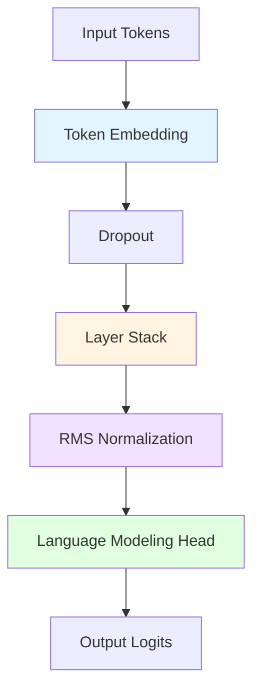
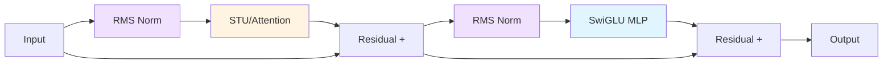

FlashSTU is a hybrid architecture that combines Spectral Transform Units (STU) with sliding window attention for efficient long-context language modeling.

## Model Overview

The FlashSTU architecture consists of several key components working together:



## Alternating Layer Architecture

The model uses an alternating pattern of STU and Attention layers. This design balances spectral filtering for long-range dependencies with attention mechanisms for content-based reasoning.

### Layer Assignment Pattern

From `model.py:43-52`:

```python
for layer_idx in range(self.n_layers):
    if layer_idx % 2 == 0:
        self.layers.append(STULayer(config, self.phi, self.n))
    else:
        self.layers.append(
            AttentionLayer(config)
            if config.use_attn
            else STULayer(config, self.phi, self.n)
        )
```

**Even layers (0, 2, 4, ...)**: STU layers for spectral filtering  
**Odd layers (1, 3, 5, ...)**: Attention layers (if `use_attn=True`) or additional STU layers

### Layer Structure

Both STU and Attention layers follow a similar pattern with pre-normalization and residual connections:



From `layers/stu_layer.py:50-53`:

```python
def forward(self, x: torch.Tensor) -> torch.Tensor:
    x = x + self.stu(self.stu_norm(x))
    x = x + self.mlp(self.mlp_norm(x))
    return x
```

## Core Components

### 1. Embedding Layer

The token embedding layer maps discrete tokens to continuous vector representations.

**Implementation** (`model.py:37-39`):
```python
self.tok_emb = nn.Embedding(
    config.vocab_size, config.n_embd, dtype=config.torch_dtype
)
```

**Key parameters**:
- `vocab_size`: Vocabulary size (default: 200,064)
- `n_embd`: Embedding dimension (default: 1,536)

### 2. RMS Normalization

Root Mean Square (RMS) normalization is used throughout the model for stable training. The implementation supports both Triton-optimized and PyTorch versions.

**Implementation** (`model.py:54-60`):
```python
self.norm = (
    TritonNorm(config.n_embd)
    if triton_norm
    else RMSNorm(config.n_embd, dtype=config.torch_dtype)
)
self.norm = self.norm.to(dtype=config.torch_dtype)
```

**Usage locations**:
- Before STU blocks (`stu_layer.py:30-34`)
- Before attention blocks (`attention_layer.py:33-37`)
- Before MLP blocks (in both layer types)
- Final normalization before language modeling head (`model.py:77`)

### 3. Language Modeling Head

The language modeling head projects hidden states back to vocabulary logits for next-token prediction.

**Implementation** (`model.py:61-63`):
```python
self.lm_head = nn.Linear(
    config.n_embd, config.vocab_size, bias=config.bias, dtype=config.torch_dtype
)
```

### 4. Weight Tying

FlashSTU implements weight tying between the token embedding and language modeling head, reducing the number of parameters and improving generalization.

**Implementation** (`model.py:64`):
```python
self.tok_emb.weight = self.lm_head.weight
```

This means the input embedding matrix and output projection matrix share the same weights. The parameter count calculation accounts for this (`model.py:86-87`):

```python
if self.tok_emb.weight is not self.lm_head.weight:
    n_params -= self.tok_emb.weight.numel()
```

## Forward Pass

The complete forward pass through the model (`model.py:70-80`):

```python
def forward(self, x: torch.Tensor) -> torch.tensor:
    tok_emb = self.tok_emb(x)           # Token embedding
    x = self.dropout(tok_emb)           # Dropout
    
    for layer in self.layers:           # Layer stack
        x = layer(x)
    
    x = self.norm(x)                    # Final normalization
    y_hat = self.lm_head(x)             # Project to vocabulary
    
    return y_hat
```

**Data flow**:
1. Input tokens → Token embeddings
2. Apply dropout
3. Process through alternating STU/Attention layers
4. Apply final RMS normalization
5. Project to vocabulary logits

## Weight Initialization

FlashSTU uses specialized initialization for different components (`model.py:90-113`):

**Linear layers**: Normal distribution with standard deviation `std = n_embd^(-0.5)`, scaled by `(2 * n_layers)^(-0.5)` for residual projection layers

**Embeddings**: Normal distribution with `std = n_embd^(-0.5)`

**STU modules**: Xavier normal initialization for spectral filter matrices (`M_phi_plus`, `M_phi_minus`, `M_inputs`, `M_filters`)

**Attention modules**: Xavier normal initialization for projection weights

## Configuration

Key architectural parameters from `config.py`:

| Parameter | Default | Description |
|-----------|---------|-------------|
| `n_embd` | 1536 | Embedding dimension |
| `n_heads` | 8 | Number of attention heads |
| `n_layers` | 26 | Total number of layers |
| `seq_len` | 8192 | Maximum sequence length |
| `window_size` | 1024 | Sliding window size for attention |
| `num_eigh` | 24 | Number of spectral filters (K) |
| `use_attn` | True | Use attention in odd layers |
| `use_approx` | True | Use low-rank approximation in STU |

## See Also

- [Spectral Filtering](/concepts/spectral-filtering) - Learn about the STU spectral transform mechanism
- [Flash Optimizations](/concepts/flash-optimizations) - Understand the performance optimizations