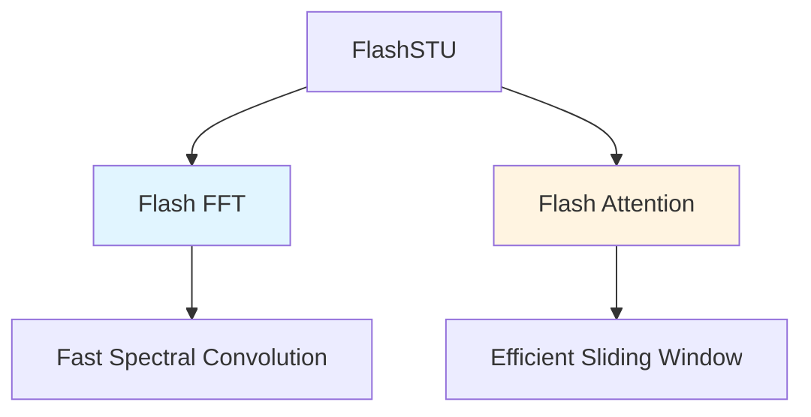

FlashSTU employs two critical performance optimizations: Flash FFT for accelerated convolutions and Flash Attention for efficient sliding window attention.

## Overview

Both optimizations target GPU memory bandwidth bottlenecks and computational efficiency:

- **Flash FFT**: Fused FFT-based convolution kernel
- **Flash Attention**: Memory-efficient attention with sliding window support



## Flash FFT Convolution

Flash FFT provides a fused CUDA kernel for FFT-based convolutions, significantly outperforming standard PyTorch FFT operations.

### Implementation

From `modules/stu.py:6-14, 28-32`:

```python
try:
    from flashfftconv import FlashFFTConv
    flash_fft_available = True
except ImportError as e:
    print(f"Unable to import FlashFFTConv: {e}. Falling back to PyTorch implementation.")
    flash_fft_available = False

class STU(nn.Module):
    def __init__(self, config, phi, n) -> None:
        self.flash_fft = (
            FlashFFTConv(self.n, dtype=torch.bfloat16)
            if config.use_flash_fft and flash_fft_available
            else None
        )
```

**Initialization**: The Flash FFT kernel is configured with sequence length `n` (rounded to nearest power of 2) and bfloat16 precision.

### Flash Convolution Algorithm

From `utils/stu_utils.py:62-98`:

```python
def flash_convolve(
    u: torch.Tensor, v: torch.Tensor, flash_fft: FlashFFTConv, use_approx: bool = True,
) -> tuple[torch.Tensor, torch.Tensor]:
    bsz, seq_len, d_in = u.shape
    _, K = v.shape
    
    # Pad to power of 2 for FFT efficiency
    padded_len = nearest_power_of_two(seq_len, round_up=True)
    pad_len = padded_len - seq_len
    
    # Create alternating sign pattern
    sgn = torch.full((1, 1, padded_len), 1, device=u.device)
    sgn[:, :, 1::2] = -1
    
    if use_approx:
        u_padded = F.pad(u.transpose(1, 2), (0, pad_len)).to(torch.bfloat16).contiguous()
        v_padded = F.pad(v.transpose(0, 1), (0, pad_len)).to(torch.float32).contiguous()
        u_conv = torch.stack([u_padded, u_padded * sgn], dim=0).reshape(2 * bsz, d_in, padded_len)
    else:
        u_k_padded = F.pad(u.transpose(1, 2), (0, pad_len)).to(torch.bfloat16).repeat_interleave(K, dim=1).contiguous()
        v_padded = F.pad(v.transpose(0, 1), (0, pad_len)).to(torch.float32).repeat(d_in, 1).contiguous()
        u_conv = torch.stack([u_k_padded, u_k_padded * sgn], dim=0).reshape(2 * bsz, K * d_in, padded_len)
    
    # Fused FFT convolution
    U_conv = flash_fft(u_conv, v_padded)
    
    # Trim back to original length
    U_conv = U_conv[..., :seq_len]
    
    # Split plus and minus components
    u_plus, u_minus = torch.chunk(U_conv, 2, dim=0)
    
    if use_approx:
        u_minus = u_minus * sgn[:, :, :seq_len]
        U_plus, U_minus = u_plus.transpose(1, 2), u_minus.transpose(1, 2)
    else:
        sgn = sgn[:, :, :seq_len].unsqueeze(-1).transpose(1, 2)
        U_plus = u_plus.view(bsz, d_in, K, seq_len).permute(0, 3, 2, 1).contiguous()
        U_minus = u_minus.view(bsz, d_in, K, seq_len).permute(0, 3, 2, 1).contiguous() * sgn
    
    return U_plus, U_minus
```

### Key Optimizations

**1. Power-of-2 Padding**

From `stu_utils.py:68-69`:
```python
padded_len = nearest_power_of_two(seq_len, round_up=True)
pad_len = padded_len - seq_len
```

FFT algorithms perform optimally when the sequence length is a power of 2. The implementation pads sequences and trims results.

**2. Memory Layout Optimization**

From `stu_utils.py:75-77`:
```python
u_padded = F.pad(u.transpose(1, 2), (0, pad_len)).to(torch.bfloat16).contiguous()
v_padded = F.pad(v.transpose(0, 1), (0, pad_len)).to(torch.float32).contiguous()
u_conv = torch.stack([u_padded, u_padded * sgn], dim=0).reshape(2 * bsz, d_in, padded_len)
```

- Transpose to place sequence dimension last for FFT
- Convert to bfloat16 for inputs (memory efficiency)
- Keep filters in float32 (numerical stability)
- Ensure contiguous memory layout

**3. Batched Processing**

Both plus and minus convolutions are batched into a single Flash FFT call (`2 * bsz` batches), reducing kernel launch overhead.

**4. Mixed Precision**

- **Inputs**: bfloat16 (reduces memory bandwidth)
- **Filters**: float32 (maintains precision)
- **Computation**: Managed by Flash FFT kernel

### Performance Benefits

**Standard PyTorch FFT** (`convolve()`):
- Separate kernel calls for FFT, multiplication, IFFT
- Multiple memory reads/writes
- No kernel fusion

**Flash FFT** (`flash_convolve()`):
- Fused FFT → multiply → IFFT in single kernel
- Reduced memory traffic
- Optimized shared memory usage
- Better instruction-level parallelism

**Speedup**: Typically 2-4x faster for long sequences (>2K tokens)

## Flash Attention

Flash Attention 2 provides memory-efficient attention with sliding window support, crucial for long-context modeling.

### Implementation

From `modules/attention.py:8-14, 68-77`:

```python
try:
    from flash_attn import flash_attn_func as fa2
except ImportError as e:
    print(f"Unable to import Triton-based flash attention: {e}. No alternative currently available.")

class Attention(nn.Module):
    def forward(self, x):
        bsz, seq_len, d_in = x.size()
        
        qkv = self.c_attn(x)
        q, k, v = torch.chunk(qkv, 3, dim=2)
        
        q = q.view(bsz, seq_len, self.n_heads, d_in // self.n_heads)
        k = k.view(bsz, seq_len, self.n_heads, d_in // self.n_heads)
        v = v.view(bsz, seq_len, self.n_heads, d_in // self.n_heads)
        
        y = fa2(
            q, k, v,
            dropout_p=self.dropout if self.training else 0.0,
            causal=True,
            window_size=(self.window_size, 0),
            alibi_slopes=self.alibi_slopes,
            softcap=self.softcap,
        )
        
        y = y.contiguous().view(bsz, seq_len, d_in)
        y = self.resid_dropout(self.c_proj(y))
        return y
```

### Key Features

**1. Sliding Window Attention**

From `attention.py:74`:
```python
window_size=(self.window_size, 0)
```

- **Left window**: `window_size` tokens (default: 1024)
- **Right window**: 0 (causal masking)
- Each token attends to at most `window_size` previous tokens

**Benefits**:
- O(n × window_size) complexity instead of O(n²)
- Enables 8K+ sequence processing
- Maintains local context modeling

**2. Causal Masking**

From `attention.py:73`:
```python
causal=True
```

Ensures autoregressive property: position `i` cannot attend to positions `j > i`.

**3. ALiBi Position Encoding**

From `attention.py:75`:
```python
alibi_slopes=self.alibi_slopes
```

Attention with Linear Biases (ALiBi) adds learned linear biases to attention scores based on distance.

**Slope generation** (`attention.py:38-57`):
```python
def _get_alibi_slopes(self, n_heads: int, interpolation_factor: float = 0.25):
    if math.log2(n_heads).is_integer():
        slopes = self._generate_slopes(n_heads)
    else:
        n = nearest_power_of_two(n_heads, round_up=False)
        slopes_power_of_two = self._generate_slopes(n)
        extra_slopes = self._generate_slopes(2 * n)
        extra_slopes_trunc = extra_slopes[0::2][: n_heads - n]
        slopes = slopes_power_of_two + extra_slopes_trunc
    
    slopes = torch.tensor(slopes, device=self.device)
    slopes = slopes * interpolation_factor  # Scale for extrapolation
    return slopes
```

**Benefits**:
- Implicit position information
- Better extrapolation to longer sequences
- No absolute position embeddings needed

**Reference**: [Train Short, Test Long (Press et al., 2021)](https://arxiv.org/pdf/2108.12409)

**4. Softcapping**

From `attention.py:76`:
```python
softcap=self.softcap  # default: 50.0
```

Caps attention logits before softmax: `logits = softcap * tanh(logits / softcap)`

**Benefits**:
- Prevents attention entropy collapse
- Improves training stability
- Better gradient flow

**Reference**: [Gemini 1.5 (Google, 2024)](https://arxiv.org/pdf/2408.00118)

### Memory Efficiency

**Standard Attention**:
- Materializes full attention matrix: O(n² × heads) memory
- Quadratic memory growth with sequence length

**Flash Attention 2**:
- Tiles computation in SRAM
- Never materializes full attention matrix
- O(n) memory usage
- Recomputes attention in backward pass (memory-compute tradeoff)

**Speedup**: 2-4x faster, 10-20x less memory for long sequences

## Configuration

### Flash FFT Settings

From `config.py:23`:
```python
use_flash_fft: bool = True
```

**Enable/disable**: Set to `False` to fall back to PyTorch FFT (for debugging or compatibility)

### Flash Attention Settings

From `config.py:14-16, 25-26`:
```python
n_heads: int = 8                # Number of attention heads
window_size: int = 1024         # Sliding window size
use_attn: bool = True           # Enable attention layers
softcap: float = 50.0           # Attention logit softcapping
```

**Tuning window_size**:
- Smaller (256-512): Faster, more local
- Larger (2048-4096): Slower, more global
- Trade-off between efficiency and receptive field

## Fallback Behavior

Both optimizations gracefully fall back to PyTorch implementations:

**Flash FFT unavailable** (`stu.py:54-61`):
```python
if self.flash_fft:
    spectral_plus, spectral_minus = flash_convolve(...)
else:
    spectral_plus, spectral_minus = convolve(...)  # PyTorch FFT
```

**Flash Attention unavailable** (`attention.py:8-13`):
```python
try:
    from flash_attn import flash_attn_func as fa2
except ImportError as e:
    print(f"Unable to import Triton-based flash attention: {e}. No alternative currently available.")
```

Note: Currently no fallback for Flash Attention; installation required for attention layers.

## Installation Requirements

To enable flash optimizations:

```bash
# Flash FFT
pip install flashfftconv

# Flash Attention 2
pip install flash-attn --no-build-isolation
```

## Performance Summary

| Component | Standard | Flash | Speedup | Memory |
|-----------|----------|-------|---------|--------|
| FFT Convolution | PyTorch FFT | Flash FFT | 2-4x | ~2x less |
| Attention | Standard | Flash Attn 2 | 2-4x | 10-20x less |
| Sequence Length | Limited by memory | 8K+ tokens | - | Enables long context |

## See Also

- [Architecture](/concepts/architecture) - Model structure using these optimizations
- [Spectral Filtering](/concepts/spectral-filtering) - The STU mechanism accelerated by Flash FFT