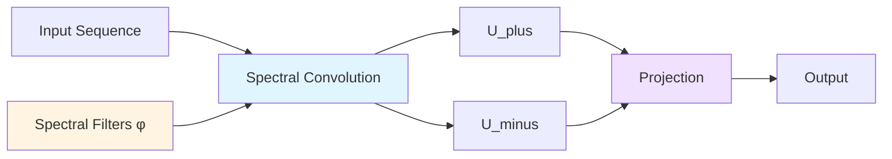
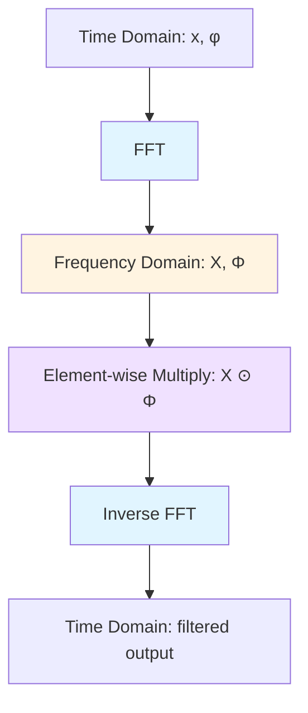

The Spectral Transform Unit (STU) is the core innovation of FlashSTU, enabling efficient long-range sequence modeling through frequency domain filtering.

## Overview

STU replaces traditional state-space models or linear attention with spectral filtering based on Hankel matrix decomposition. This approach:

- Operates in the frequency domain for efficient convolutions
- Uses learnable spectral filters derived from Hankel matrices
- Supports low-rank approximations for computational efficiency
- Handles sequences up to 8K+ tokens effectively



## Hankel Matrices

Hankel matrices are constant along anti-diagonals and provide a mathematical foundation for modeling sequential dependencies.

### Construction

From `utils/stu_utils.py:10-23`:

```python
def get_hankel(seq_len: int, use_hankel_L: bool = False) -> np.ndarray:
    entries = np.arange(1, seq_len + 1, dtype=np.float64)
    i_plus_j = entries[:, None] + entries[None, :]
    
    if use_hankel_L:
        sgn = (-1.0) ** (i_plus_j - 2.0) + 1.0
        denom = (i_plus_j + 3.0) * (i_plus_j - 1.0) * (i_plus_j + 1.0)
        Z = sgn * (8.0 / denom)
    elif not use_hankel_L:
        Z = 2.0 / (i_plus_j**3 - i_plus_j)
    
    return Z
```

**Two variants**:

1. **Standard Hankel**: `Z[i,j] = 2.0 / ((i+j)³ - (i+j))`
2. **Hankel-L**: `Z[i,j] = sgn(i+j) × 8.0 / ((i+j+3)(i+j-1)(i+j+1))`

The Hankel-L variant uses a different weighting scheme and can be more parameter-efficient since it only requires one set of filters (`use_hankel_L=True` in config).

### Eigendecomposition

Spectral filters are derived from the eigendecomposition of the Hankel matrix.

From `utils/stu_utils.py:25-37`:

```python
def get_spectral_filters(
    seq_len: int, 
    K: int, 
    use_hankel_L: bool = False, 
    device: torch.device = None,
    dtype: torch.dtype = torch.bfloat16,
) -> torch.Tensor:
    Z = get_hankel(seq_len, use_hankel_L)
    sigma, phi = np.linalg.eigh(Z)
    sigma, phi = sigma[-K:], phi[:, -K:]  # Take top K eigenvectors
    phi *= sigma ** 0.25                   # Scale by eigenvalues
    return torch.tensor(phi, device=device, dtype=dtype)
```

**Process**:
1. Compute Hankel matrix Z for given sequence length
2. Eigendecompose: `Z = Φ Σ Φᵀ`
3. Select top K eigenvectors (largest eigenvalues)
4. Scale eigenvectors by `σ^0.25` to form spectral filters `φ`

**Shape**: `[seq_len, K]` where K is `num_eigh` from config (default: 24)

## Spectral Convolution

The core STU operation performs convolution in the frequency domain using FFT.

### Standard Convolution

From `utils/stu_utils.py:39-60`:

```python
def convolve(u: torch.Tensor, v: torch.Tensor, n: int, use_approx: bool = True):
    bsz, seq_len, d_in = u.shape
    
    # Create alternating sign pattern
    sgn = torch.full((1, seq_len, 1), 1, device=u.device)
    sgn[:, 1::2] *= -1
    
    # Transform filters to frequency domain
    v = torch.fft.rfft(v, n=n, dim=1)
    
    # Stack original and sign-flipped inputs
    U = torch.stack([u, u * sgn], dim=-1).to(torch.float32)
    U = torch.fft.rfft(U, n=n, dim=1)
    
    # Multiply in frequency domain (convolution)
    U_conv = torch.fft.irfft(v * U, n=n, dim=1)[:, :seq_len]
    
    # Separate plus and minus components
    U_plus, U_minus = torch.unbind(U_conv, dim=-1)
    U_minus = U_minus * sgn
    
    return U_plus, U_minus
```

**Key steps**:
1. Create sign pattern `[1, -1, 1, -1, ...]` for alternating filtering
2. Transform both inputs and filters to frequency domain via FFT
3. Perform element-wise multiplication (convolution theorem)
4. Transform back to time domain via inverse FFT
5. Return both plus and minus components

**Convolution theorem**: Convolution in time domain = multiplication in frequency domain

### Why Plus and Minus?

The STU performs two parallel convolutions:
- **U_plus**: Standard convolution
- **U_minus**: Convolution with alternating sign pattern

This dual-path design captures different frequency characteristics. When `use_hankel_L=False`, both are combined (`stu.py:79`):

```python
return spectral_plus if self.use_hankel_L else spectral_plus + spectral_minus
```

## STU Forward Pass

The STU module implements two computational paths based on `use_approx`.

### Low-Rank Approximation (use_approx=True)

From `modules/stu.py:50-61`:

```python
if self.use_approx:
    # Contract inputs and filters over the K and d_in dimensions, then convolve
    x_proj = x @ self.M_inputs                    # [B, L, d_out]
    phi_proj = self.phi @ self.M_filters          # [L, d_in]
    if self.flash_fft:
        spectral_plus, spectral_minus = flash_convolve(
            x_proj, phi_proj, self.flash_fft, self.use_approx
        )
    else:
        spectral_plus, spectral_minus = convolve(
            x_proj, phi_proj, self.n, self.use_approx
        )
```

**Parameters**:
- `M_inputs`: `[d_in, d_out]` - Projects input features
- `M_filters`: `[K, d_in]` - Combines spectral filters

**Advantages**:
- Fewer parameters
- Faster computation
- Better for larger embedding dimensions

**Shape flow**:
```
x: [B, L, d_in] @ M_inputs: [d_in, d_out] → x_proj: [B, L, d_out]
φ: [L, K] @ M_filters: [K, d_in] → phi_proj: [L, d_in]
```

### Full Computation (use_approx=False)

From `modules/stu.py:62-77`:

```python
else:
    # Convolve inputs and filters
    if self.flash_fft:
        U_plus, U_minus = flash_convolve(
            x, self.phi, self.flash_fft, self.use_approx
        )
    else:
        U_plus, U_minus = convolve(x, self.phi, self.n, self.use_approx)
    
    # Then, contract over the K and d_in dimensions
    spectral_plus = torch.tensordot(
        U_plus, self.M_phi_plus, dims=([2, 3], [0, 1])
    )
    if not self.use_hankel_L:
        spectral_minus = torch.tensordot(
            U_minus, self.M_phi_minus, dims=([2, 3], [0, 1])
        )
```

**Parameters**:
- `M_phi_plus`: `[K, d_in, d_out]` - Projection for plus component
- `M_phi_minus`: `[K, d_in, d_out]` - Projection for minus component (if not using Hankel-L)

**Advantages**:
- More expressive
- Separate learned projections for each filter
- Better for smaller models

**Shape flow**:
```
U_plus: [B, L, K, d_in] ⊗ M_phi_plus: [K, d_in, d_out] → [B, L, d_out]
U_minus: [B, L, K, d_in] ⊗ M_phi_minus: [K, d_in, d_out] → [B, L, d_out]
```

## Frequency Domain Filtering

The spectral filtering mechanism operates entirely in the frequency domain:



**Benefits**:
1. **O(n log n) complexity** via FFT instead of O(n²) for direct convolution
2. **Global receptive field** - each output depends on entire sequence
3. **Parallelizable** - no sequential dependencies
4. **Learnable filters** - spectral weights adapted during training

## Configuration Options

From `config.py` and their impact:

| Parameter | Default | Effect |
|-----------|---------|--------|
| `num_eigh` | 24 | Number of spectral filters (K) |
| `use_hankel_L` | False | Use Hankel-L variant (single filter set) |
| `use_approx` | True | Enable low-rank approximation |
| `seq_len` | 8192 | Sequence length for Hankel matrix |

**Parameter counts** (per STU layer):
- **Approx mode**: `d_in × d_out + K × d_in`
- **Full mode, standard Hankel**: `2 × K × d_in × d_out`
- **Full mode, Hankel-L**: `K × d_in × d_out`

## See Also

- [Architecture](/concepts/architecture) - Overall model structure
- [Flash Optimizations](/concepts/flash-optimizations) - Performance improvements for spectral convolution